# Лабораторна робота № 4
# Панченко Даниїл, ІПЗ-4.01

# Дослідження методу Градієнтного Спуску (ГС) для розв'язання задачі мультилатерації (TDoA) методом Найменших Квадратів (МНК).

[cite_start]**Мета роботи:** Практично реалізувати та дослідити роботу алгоритму градієнтного спуск, аналіз впливу гіперпараметрів, шуму та геометрії на точність позиціонування [cite: 147-151].

---

## Завдання 1: Контрольний Запуск ("Ідеальний світ")
[cite_start]**Параметри:** `NOISE_LEVEL = 0`, `LEARNING_RATE = 0.01`, `INITIAL_GUESS = [50000, 50000]`, `TRUE_POSITION = [45000, 35000]` [cite: 167-173].

* **Фінальна похибка позиціонування:** 0.0008303537898987766 метрів.
* **Кількість ітерацій:** 433.

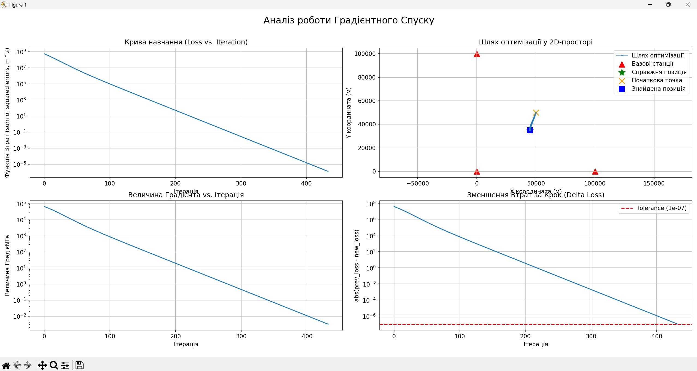

### Аналіз та Контрольні Питання: 

1. **Запишіть фінальну похибку позиціонування. Чому вона не дорівнює 0.00 метрів, навіть за відсутності шуму?**
   Похибка становить приблизно $0.00083$ метра. Вона не дорівнює абсолютному нулю, оскільки градієнтний спуск це чисельний метод. Оскільки алгоритм припиняє роботу коли зміна функції втрат стає меншою за встановлений       поріг `TOLERANCE` ($1E-7$), зупиняючись у безпосередній близькості до ідеальної точки, але не в ній самій.
2. **Проаналізуйте графік "Величина Градієнта". Як його поведінка пов'язана з графіком "Крива навчання"?**
   Величина градієнта відображає крутизну поверхні функції втрат у поточній точці. На початку експерименту, коли похибка велика, градієнт має високе значення, що зумовлює стрімке падіння кривої на графіку "Крива    навчання" (Loss).

---

## Завдання 2: Дослідження learning_rate ("Проблема Золотоволоски")
[cite_start]**Мета:** Продемонструвати компроміс (трейдоф) між стабільністю алгоритму та швидкістю його збіжності [cite: 178-179].

**Налаштування:** `NOISE_LEVEL = 1e-6`, `INITIAL_GUESS = [50000, 50000]`, `TRUE_POSITION = [45000, 35000]`. [cite_start]Послідовна зміна параметра `LEARNING_RATE` [cite: 180-184].

| Експеримент | LR | Фінальна похибка (м) | К-сть ітерацій | Результат |
| :--- | :--- | :--- | :--- | :--- |
| **2a (Розбіжність)** | 2.0 | 726941.61 | 100000 | Досягнуто ліміту (Розбіжність алгоритму)  |
| **2b (Стагнація)** | 1e-5 | 639.04 | 10000 | Досягнуто ліміту (Стагнація алгоритму)  |
| **2c (Оптимальний)** | 0.01 | 178.66 | 39 | Успішна збіжність до мінімуму  |

### Графіки результатів
*Експеримент 2a (Розбіжність):*

*Експеримент 2b (Стагнація):*
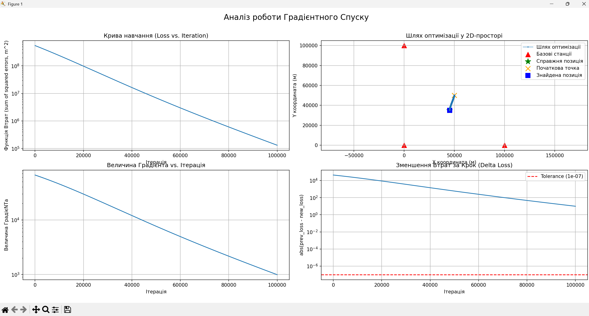

*Експеримент 2c (Оптимальна збіжність):*
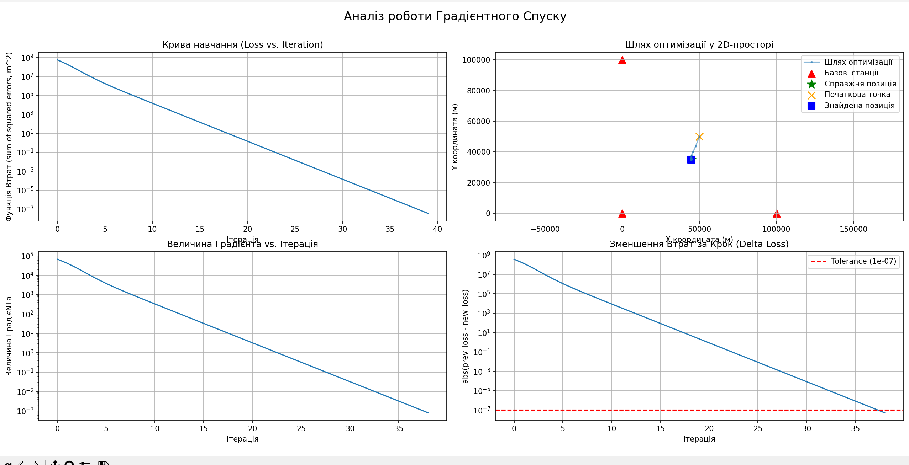

### Аналіз та Контрольні Питання: 
1. **Для 2a: Що сталося з Loss? Проаналізуйте 2D-графік шляху. Поясніть термін "розбіжність" (divergence), спираючись на отримані графіки.**
   Як чітко видно на графіку "Крива навчання" для 2a, значення Loss миттєво злетіло до величезних величин. На 2D-графіку шлях оптимізатора перетворився на хаотичну павутину ліній, яка охоплює територію у мільйони         метрів і виходить далеко за межі розташування станцій. Термін **"розбіжність"** означає, що крок навчання ($LR=2.0$) був занадто великим. [cite_start]Замість того, щоб спускатися на дно "чаші", алгоритм щоразу         перестрибував його, відштовхуючись все вище і далі від правильного рішення[cite: 186, 187].
2. **Для 2b: Чи зійшовся алгоритм за MAX_ITERATIONS? Порівняйте його криву навчання з 2c. Поясніть термін "стагнація" (stagnation).**
    Алгоритм не зійшовся навіть досягнувши максимальної кількості ітерацій (100 000), зупинившись з похибкою 639.04 метрів. На графіку 2b крива навчання виглядає як дуже повільний, стабільний прямий спуск, тоді як в       експерименті 2c (де $LR=0.01$) крива стрімко падає вниз і досягає дна всього за 39 ітерацій. Термін **"стагнація"** описує стан, коли крок оптимізатора настільки мізерний, що він робить мікроскопічні просування і      просто "застрягає" у часі, не маючи змоги досягти мінімуму за адекватну кількість обчислень 
3. **Чому learning_rate є найважливішим гіперпараметром градієнтного спуску?**
   Цей параметр безпосередньо визначає баланс алгоритму. Як доводять експерименти, неправильний вибір призводить до фатальних наслідків: завеликий крок повністю ламає математичну логіку пошуку (розбіжність 2a), а         замалий робить систему непрактично повільною (стагнація 2b).

   ---

## Завдання 3: Дослідження NOISE_LEVEL ("Сміття на вході — сміття на виході")
[cite_start]**Мета:** Показати пряму залежність між якістю вхідних даних (рівнем шуму) та точністю результату позиціонування [cite: 191-192].

**Налаштування:** `LEARNING_RATE = 0.01`, `INITIAL_GUESS = [50000, 50000]`, `TRUE_POSITION = [45000, 35000]`. [cite_start]Послідовна зміна параметра `NOISE_LEVEL`[cite: 193].

| Експеримент | NOISE_LEVEL (в секундах) | Noise (в метрах) | Фінальна Похибка (в метрах) |
| :--- | :--- | :--- | :--- |
| **3a (Високоточний)** | 1e-9 (1 нс) | ~0.3 | 0.27 |
| **3b (Реалістичний)** | 1e-6 (1 мкс) | ~300 | 345.19 |
| **3c (Зламаний)** | 1e-4 (100 мкс) | ~30,000 | 11581.42 |

### Графіки результатів
*Експеримент 3a:*
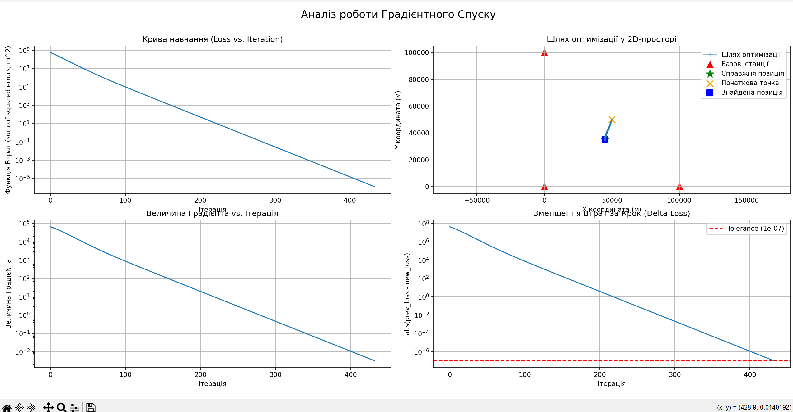

*Експеримент 3b:*
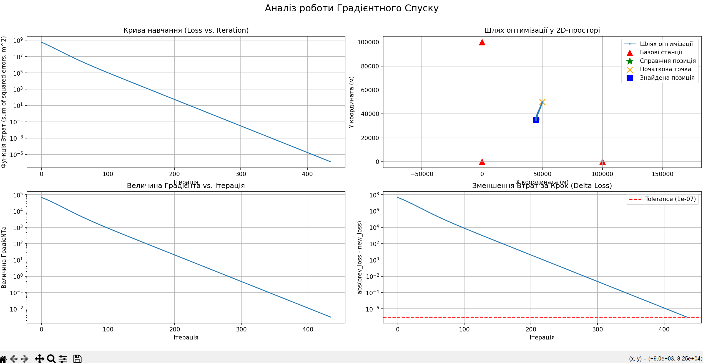

*Експеримент 3c (Зламаний):*
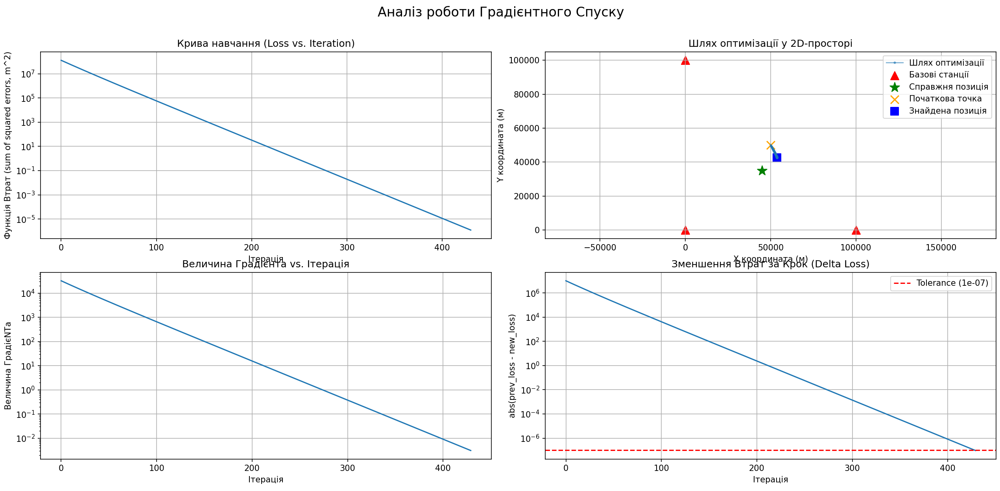

### Аналіз та Контрольні Питання:

1. **Поясніть, чому в експерименті 3c алгоритм все одно сходиться (графік Loss падає), але фінальна похибка позиціонування є катастрофічною? [cite_start]До якого мінімуму він збігся?** [cite: 199-200]
   Алгоритм градієнтного спуску "сліпий" щодо реального фізичного світу — він нічого не знає про $TRUE\_POSITION$. Його єдина задача — знайти математичний мінімум (дно) тієї функції втрат, яку йому передали. 
   
   В експерименті 3c через гігантський шум ($1e-4$) вхідні дані були настільки сильно спотворені, що форма функції втрат змінилася. Алгоритм чесно і успішно знайшов дно цієї "зламаної" чаші (саме тому Loss падає і алгоритм рапортує про збіжність). Однак цей знайдений математичний мінімум помилкових даних фізично розташований за десятки кілометрів від справжнього об'єкта. Це класична демонстрація принципу "сміття на вході — сміття на виході": ідеально працюючий алгоритм видасть катастрофічний результат, якщо самі дані є хибними.

---

## Завдання 4: Дослідження INITIAL_GUESS ("Вплив початкової точки")
[cite_start]**Мета:**Показати, як початкова точка впливає на швидкість збіжності.[cite: 201, 202].

**Налаштування:** `NOISE_LEVEL = 1e-6`, `LEARNING_RATE = 0.01`, `TRUE_POSITION = [45000, 35000]`. [cite_start]Послідовна зміна параметра `INITIAL_GUESS`[cite: 203].

| Експеримент | Початкова точка (INITIAL_GUESS) | К-сть ітерацій | Фінальна похибка (м) |
| :--- | :--- | :--- | :--- |
| **4a (Добре)** | [50000, 50000] | 434 | 206.11 |
| **4b (Погане)** | [0, 0] | 366 | 202.40 |
| **4c (Дуже погане)** | [-500000, -500000] | 100,000 | 961341.30 |

### Графіки результатів
*Експеримент 4a (Добре):*
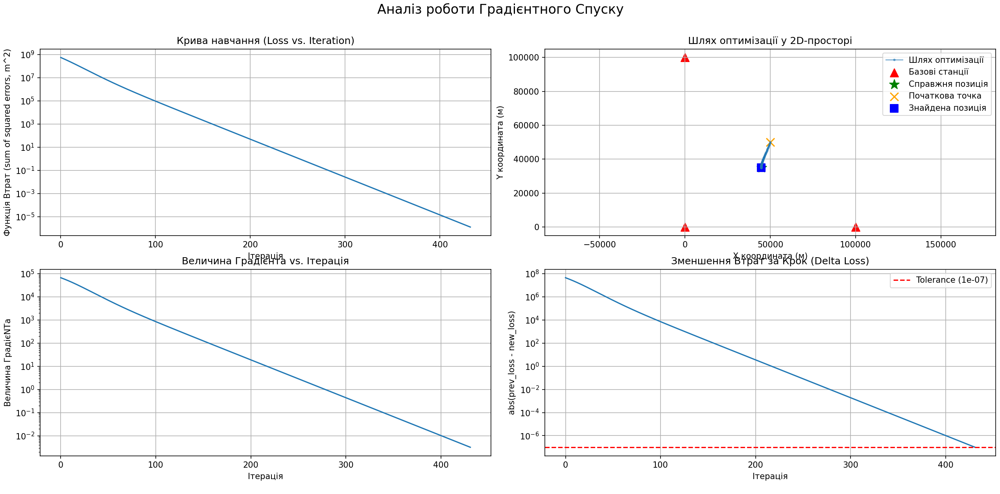

*Експеримент 4c (Погане):*
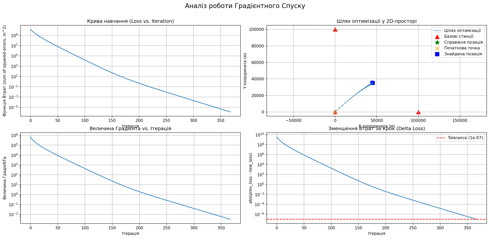

*Експеримент 4c (Дуже погане):*
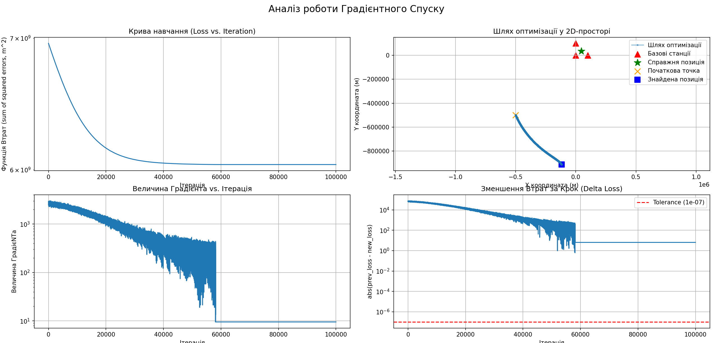

### Аналіз та Контрольні Питання до Завдання 4:

1. **Порівняйте кількість ітерацій, яка знадобилася для збіжності у кожному експерименті.**
   Отримані дані демонструють неочевидний, але класичний для градієнтного спуску ефект: алгоритм зійшовся швидше з віддаленої точки `[0, 0]` (366 ітерацій), ніж з набагато ближчої до цілі точки `[50000, 50000]` (434 ітерації). 
   Це пояснюється топографією функції втрат. Розмір кроку оптимізатора залежить від крутизни схилу (величини градієнта). Точка `[0, 0]` знаходиться на більш "крутому" схилі функції, що дозволило алгоритму робити величезні початкові кроки і швидко подолати велику відстань. Точка `[50000, 50000]` знаходилася в більш пологий зоні ближче до дна, через що алгоритм був змушений робити багато дрібних кроків. 
   Однак, експеримент 4c доводить, що якщо початкова точка знаходиться екстремально далеко `[-500000, -500000]`, алгоритму просто не вистачає ліміту у 100,000 ітерацій, щоб подолати цю дистанцію.

2. **Чи вплинуло початкове припущення на фінальну точність? Чому так (або чому ні)?**
   Для адекватних початкових точок (4a та 4b) припущення **не вплинуло** на фінальну точність. В обох випадках алгоритм прийшов в одну й ту саму точку з похибкою ~202-206 метрів (ця похибка зумовлена виключно шумом `1e-6`, а не алгоритмом). Це підтверджує, що наша функція втрат (МНК) має опуклу форму з єдиним глобальним мінімумом. З якого б боку ми не почали спуск, алгоритм скотиться в одне й те саме "дно".
   Але 4c показує критичний виняток: якщо почати пошук занадто далеко, алгоритм не встигає знайти цей мінімум за відведений ліміт ітерацій, залишаючи похибку у сотні кілометрів.

---

## Завдання 5: Дослідження Геометрії ("Прокляття плаского каньйону" - GDOP)
[cite_start]**Мета:** Продемонструвати, як погана геометрія базових станцій (GDOP) робить задачу чисельно нестійкою і катастрофічно посилює вплив існуючого шуму на кінцевий результат[cite: 67].

**Налаштування:** `NOISE_LEVEL = 1e-6`, `LEARNING_RATE = 0.01`, `INITIAL_GUESS = [50000, 50000]`. Зміна цільової позиції об'єкта `TRUE_POSITION` [cite: 68-70].

| Експеримент | Позиція цілі (TRUE_POSITION) | К-сть ітерацій | Фінальна похибка (м) |
| :--- | :--- | :--- | :--- |
| **5a (Хороша геометрія)** | [45000, 35000] | 431 | 254.03 |
| **5b (Погана геометрія)** | [45000, -135000] | 100000 | 5163.91 |

### Графіки результатів
*Експеримент 5a (Хороша геометрія):*
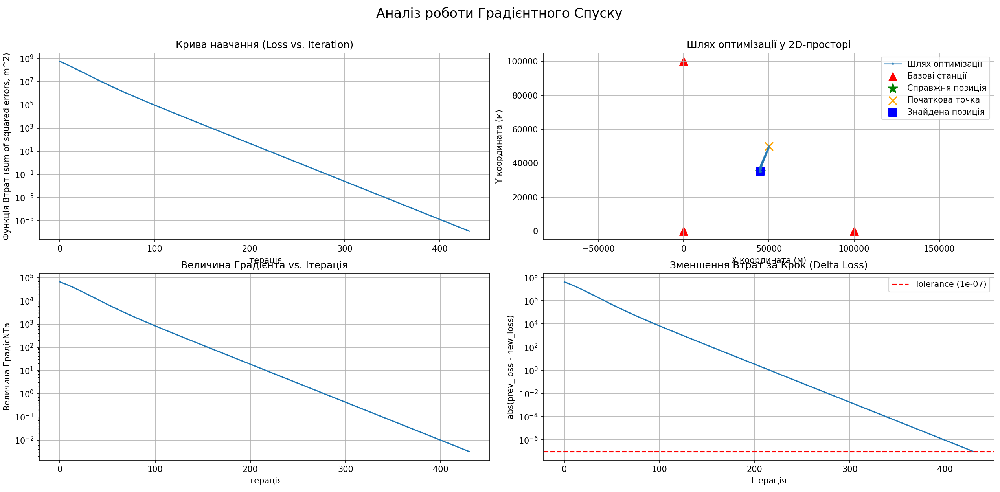

*Експеримент 5b (Погана геометрія):*
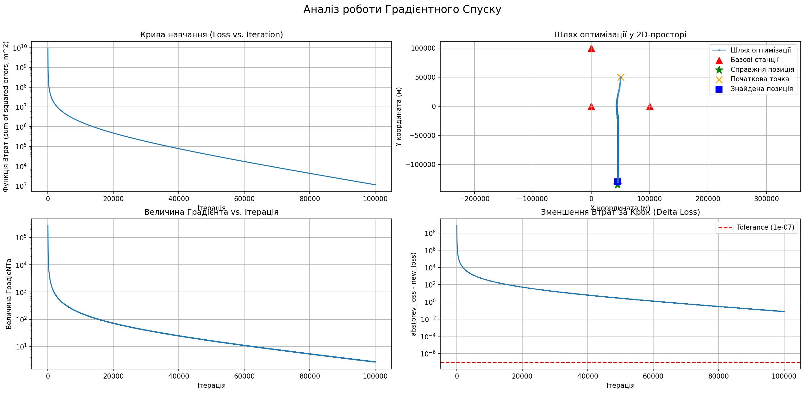

### Аналіз та Контрольні Питання:

1. **Порівняйте фінальну похибку позиціонування для 5a та 5b. Чому результати відрізняються на порядки при однаковому рівні шуму?**
   Незважаючи на те, що рівень шуму в обох випадках був абсолютно однаковим ($1e-6$), похибка відрізняється кардинально: ~254 метри для 5a проти понад 5163 метрів (більше 5 кілометрів) для 5b. Це класичний прояв ефекту **GDOP (Geometric Dilution of Precision)**. Коли об'єкт знаходиться далеко за межами базових станцій (5b), лінії позиціонування (гіперболи) йдуть майже паралельно і перетинаються під дуже гострими кутами. Математично система стає "погано обумовленою": найменша мікросекундна похибка у часі перетворюється на гігантський просторовий зсув точки.

2. **Проаналізуйте графік "Delta Loss" для експерименту 5b. Чому алгоритм зупинився, хоча похибка позиціонування була ще величезною? Поясніть аналогію з "пласким дном каньйону".**
   Як чітко видно на графіку "Зменшення Втрат за Крок (Delta Loss)" для 5b, синя крива **не торкнулася** червоної пунктирної лінії `TOLERANCE`. Алгоритм зупинився не тому, що знайшов мінімум, а тому, що вичерпав ліміт у 100,000 ітерацій. 
   Це відбувається через деформацію функції втрат. Через погану геометрію функція втратила форму ідеальної "чаші" (як у 5a) і перетворилася на довгий **"плаский каньйон"**. На дні цього каньйону поверхня настільки рівна, що градієнт (крутизна схилу) стає мізерним. Відповідно, алгоритм робить настільки малі кроки, що фактично "повзе" на місці. Йому просто не вистачило навіть ста тисяч ітерацій, щоб пройти цей нескінченний плаский шлях, і він зупинився з величезною похибкою.

---

## Завдання 6 (Бонус): Дослідження TOLERANCE ("Ціна точності")

**Мета:** Показати компроміс (трейдоф) між точністю обчислень та обчислювальними витратами (часом), а також довести, що математична точність не здатна компенсувати фізичні похибки даних.

**Налаштування:** Погана геометрія `TRUE_POSITION = [45000, -135000]`, `NOISE_LEVEL = 1e-6`, `LEARNING_RATE = 0.01`. [cite_start]Зміна параметра `TOLERANCE` та `MAX_ITERATIONS` [cite: 78-81].

| Експеримент | TOLERANCE | К-сть ітерацій | Фінальна похибка (м) |
| :--- | :--- | :--- | :--- |
| **6a (Швидко і брудно)** | 1e-2 | 100000 | 9950.40 |
| **6b (Базовий)** | 1e-7 | 100000 | 679.45 |
| **6c (Надточний)** | 1e-12 | 681834 | 6676.86 |

### Графіки результатів
*Експеримент 6a (Швидко і брудно):*
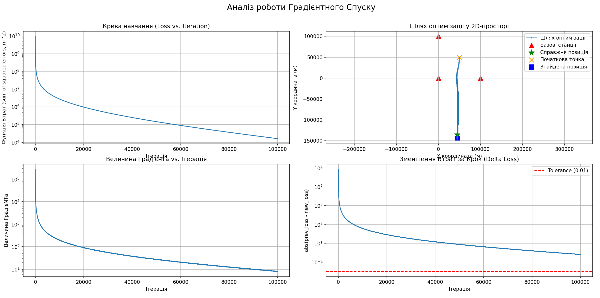

*Експеримент 6b (Базовий):*
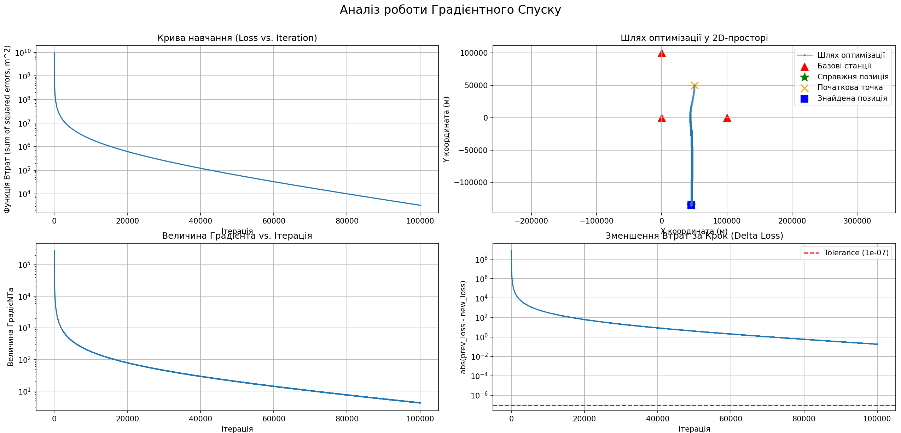

*Експеримент 6c (Надточний):*
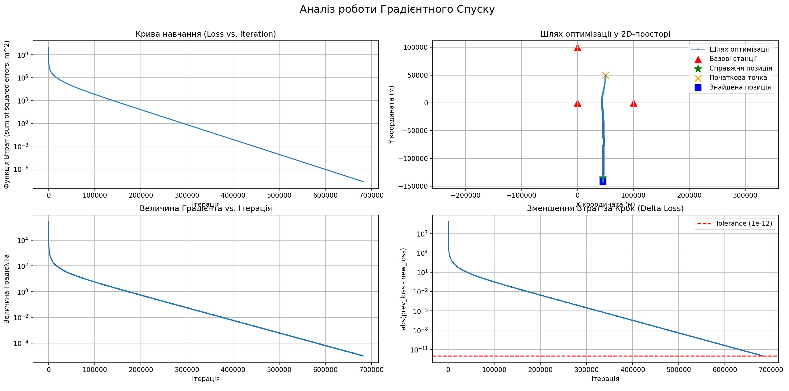

### Аналіз та Контрольні Питання:

1. **Чи варто було "платити" додаткові десятки (або сотні) тисяч ітерацій за перехід від 1e-7 до 1e-12?**
   Абсолютно не варто. Як чітко показують отримані дані, для досягнення надвисокої математичної точності (`1e-12`) алгоритму знадобилося аж 681,834 ітерації — це майже в 7 разів більше обчислень порівняно з базовим лімітом. Незважаючи на такі колосальні витрати обчислювального часу, фінальна похибка позиціонування не тільки не зменшилася до нуля, а й склала величезні 6.6 кілометрів (6676.86 м). Це доводить, що алгоритм просто марно витратив ресурси процесора на те, щоб "ідеально точно" вирахувати хибну координату на дні нашого деформованого каньйону.

2. **Поясніть, чому TOLERANCE не може виправити фундаментальні проблеми (шум та погану геометрію).**
   Параметр `TOLERANCE` відповідає виключно за математичну глибину пошуку — він вказує алгоритму, коли зупинитися на шляху до дна заданої функції втрат. Однак через наявність шуму в даних та надзвичайно погану геометрію станцій (GDOP), сама форма цієї функції втрат є спотвореною. Її математичний мінімум фізично зсунутий на кілометри від реального місця розташування об'єкта. 
   Оскільки алгоритм не має інформації про реальний світ і є "сліпим" інструментом (він лише розв'язує надане рівняння), жодне збільшення внутрішньої математичної точності (`TOLERANCE`) не здатне виправити спотвореність самих вхідних даних. Спрацьовує базовий закон: "сміття на вході — сміття на виході".

---

## Загальний висновок до лабораторної роботи
На основі проведених експериментальних досліджень можна зробити висновок, що на точність та швидкість роботи алгоритму градієнтного спуску в задачах навігації найбільше впливають:
1. **Якість вхідних даних (Шум):** Є фундаментальною межею точності. Алгоритм бездоганно оптимізує ті дані, які йому надали, і принципово не здатний самостійно виправити фізичну похибку вимірювань.
2. **Геометрія системи (GDOP):** Погане розташування станцій відносно об'єкта перетворює цільову функцію на "плаский каньйон", роблячи математичну систему вразливою. Навіть мікроскопічний шум (в 1 мікросекунду) при поганій геометрії трансформується у гігантські кілометрові похибки позиціонування.
3. **Швидкість навчання (Learning Rate):** Є критичним гіперпараметром, що визначає саму можливість знайти рішення. Лише оптимально підібраний крок гарантує стабільну збіжність, запобігаючи руйнуванню пошуку (розбіжності) або нескінченним обчисленням (стагнації).
4. **Обчислювальна точність (Tolerance):** Має бути раціонально збалансованою. Надмірна вимога до точності (`1e-12`) не покращує результат на зашумлених даних з поганою геометрією, а лише призводить до невиправданої втрати обчислювальних ресурсів.
